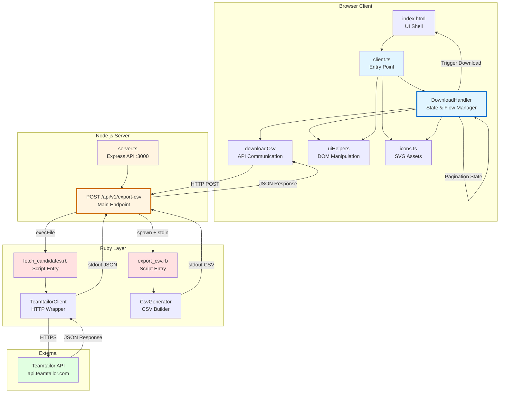

# Architecture Mindmap

Critical components and data flow:

## **Core Data Flow**
1. **Browser** → User clicks download button
2. **Client.ts** → DownloadHandler makes API call
3. **Server.ts** → Express receives request, orchestrates Ruby scripts
4. **Ruby Scripts** → Fetch from Teamtailor API → Convert to CSV
5. **Server** → Returns CSV + pagination metadata
6. **Browser** → Downloads file, updates UI for next batch

---

## ** Frontend (Browser)**
- **client.ts** - Initializes app on DOM ready
- **DownloadHandler** - Core state machine handling:
  - Button clicks
  - Pagination state (tracks downloaded records)
  - UI transitions (download → next batch → refresh)
- **downloadCsv.ts** - Thin API wrapper (fetch + blob creation)
- **uiHelpers.ts** - DOM utilities (status messages, button content)
- **icons.ts** - SVG definitions (download, reload)

---

## ** Backend (Node.js Express)**
- **server.ts** - Single endpoint architecture
  - `POST /api/v1/export-csv` - Main workflow orchestrator
  - Extracts pagination cursor from URL
  - Spawns Ruby processes:
    1. `fetch_candidates.rb` (via execFile)
    2. `export_csv.rb` (via spawn + stdin pipe)
  - Returns `{csv, meta, links, recordCount}`
  - Serves static files (no CORS needed)

---

## ** Ruby Layer**
- **fetch_candidates.rb** - CLI script wrapper
  - Reads `API_KEY` + `PAGE_AFTER` from env
  - Outputs JSON to stdout
- **TeamtailorClient** - HTTParty wrapper
  - Fetches candidates with job applications
  - Handles API versioning, pagination
- **export_csv.rb** - CLI script wrapper
  - Reads JSON from stdin
  - Outputs CSV to stdout
- **CsvGenerator** - Business logic
  - Parses JSON:API format
  - Denormalizes candidates × job applications
  - Handles missing data gracefully

---

## ** Key Patterns**
- **Process Isolation** - Node spawns Ruby for each API operation
- **Streaming** - CSV generation uses stdin/stdout pipes
- **Pagination** - Client tracks `links.next` URL, server stateless
- **Progressive Download** - Downloads one batch at a time, accumulates count
- **Error Boundaries** - Each layer has try/catch with specific error messages

---

## ** Tech Stack**
- **Frontend**: TypeScript, Vanilla JS (no framework), Vite build
- **Backend**: Express 5, Node 20+
- **Scripts**: Ruby 3.x, HTTParty, CSV stdlib
- **Testing**: Vitest (Node), RSpec (Ruby)

---

## ** External Dependencies**
- **Teamtailor API** - Source of candidates data
  - Auth: Bearer token
  - Format: JSON:API with includes
  - Pagination: Cursor-based (`page[after]`)